# ORIGIN_MO9_0301 — 원본 화면설계서 요금제 구간 전문 (slide 75~93)

> **원본** `뉴다이렉트몰화면설계서_MOBILE_1.유심_가입신청서_v27.6_중고폰 보험 안내 수정.pptx` (364 slides)
> **대상** slide **75 ~ 93** (19장) — 요금제 목록 · 팝업 · 확정 이후 bottomsheet 전체
> **작성** 2026-08-18 · 원본 pptx에서 도형·표·좌표 단위로 전량 추출
>
> ## 이 문서의 목적
> **원본 pptx를 다시 열지 않아도 되도록** 요금제 구간 정의를 전문 그대로 옮긴 문서입니다.
> 문구·코드·금액·CMS 경로·담당자·수정일까지 원본 표기를 그대로 보존합니다.
> 원본의 오타(`OoS`, `24.12.26`/`24.12.27` 불일치 등)도 **교정하지 않고 그대로 적고 주석으로 표시**했습니다.
>
> 판단·해석은 이 문서에 넣지 않습니다. 개선 판단은 `docs/ORIGIN_GAP.md`, 확정 정의는 `index.html` 04/05 탭입니다.
>
> **원본 슬라이드 이미지도 함께 보관합니다** — `docs/origin-slides/slide-075.png` ~ `slide-093.png` (19장, 110dpi).
> 각 장 제목 아래에 해당 슬라이드가 삽입돼 있어 **레이아웃·주석 위치까지 pptx 없이 확인**할 수 있습니다.

---

## 0. 슬라이드 인덱스

| # | 화면 코드 | 화면명 | 최종 수정 | 작성자 |
|---|---|---|---|---|
| 75 | — | 가입신청서 - 요금제 목록 노출 (노출 기준 정의) | — | — |
| 76 | (신규) | 요금제 선택 화면 진입 시, 안내 팝업 | 2025.08.26 | 김윤교 |
| 77 | `MO9_0301` | 요금제 목록 (1/3) : 추천 요금제, 요금제 필터, 요금제 그룹 | 2024.09.25 | 유정근 |
| 78 | `MO9_0301` | 요금제 목록 (2/3) : 요금제 정보 | 2024.06.28 | 양수빈 |
| 79 | `MO9_0301` | 요금제 목록 (3/3) : 월 납부금액 & 제휴카드 할인금액 하단 고정 영역 | 2025.03.05 | 유정근 |
| 80 | `MO9_0301_틴즈클럽` | 요금제 목록 : 갤럭시 틴즈 요금제 정보 — **온라인 신청** | 2024.11.12 | 유정근 |
| 81 | `MO9_0301_틴즈클럽` | 요금제 목록 : 갤럭시 틴즈 요금제 정보 — **전화 상담 신청** | 2024.11.12 | 유정근 |
| 82 | `MO9_0301_P01_제휴카드 할인 계산해보기_팝업` | [팝업] 제휴카드 할인 계산해보기 | 2023.11.10 | 유정근 |
| 83 | `MO9_0301` | S Plus - 요금제 선택 | 2024.06.28 | 양수빈 |
| 84 | `MO9_0301_유독할인_요금제 변경 안내 팝업` | 요금제 선택 : 유독할인 요금제 | 2023.11.06 | 유정근 |
| 85 | `MO9_0301_데이터 0GB 차단 안내 팝업` | 데이터차단 (0GB/통화기본) — **셀프개통 불가** | 2024.12.27 | 유정근 |
| 86 | `MO9_0301_데이터 0GB 차단 안내 팝업` | 데이터차단 (0GB/통화기본) — **상담사 개통 안내** | 2024.12.27 | 유정근 |
| 87 | `MO9_0301_실손약정 플랜 가입 안내 팝업` | 요금제 선택 : 실손약정 요금제 3종 | 2025.10.23 | 유정근 |
| 88 | `MO9_0301_ 더알뜰플랜2가입안내 팝업` | 요금제 선택 : 더알뜰플랜2 요금제 3종 | 2025.12.02 | 유정근 |
| 89 | `MO9_0301_L01` | [bottomsheet] 사은품선택 <sup>신규개발</sup> | 2024.10.29 | 유정근 |
| 90 | `MO9_0301_L01` | [bottomsheet] 사은품선택 : S Plus 요금제 | 2023.10.13 | 양수빈 |
| 91 | `MO9_0301_L04` | [bottomsheet] 쿠팡 회원정보 입력 | 2023.07.19 | — |
| 92 | `MO9_0301_L02` | [bottomsheet] 1회선번호지정 | 2023.05.12 | — |
| 93 | `MO9_0301_L03` | [bottomsheet] 네이버인증 | — | — |

**공통 경로 표기** — `가입신청서 > 1. 가입조건 : 요금제 선택`
**공통 스텝 인디케이터** — `1 가입조건` · `2` · `3` (전화 상담 신청은 `1 가입조건` · `2` 2단계)
**공통 타이틀** — `가입하실 요금제를 선택해 주세요.`
**공통 CTA** — `다음`

---

## 1. slide 75 — 요금제 목록 노출 기준

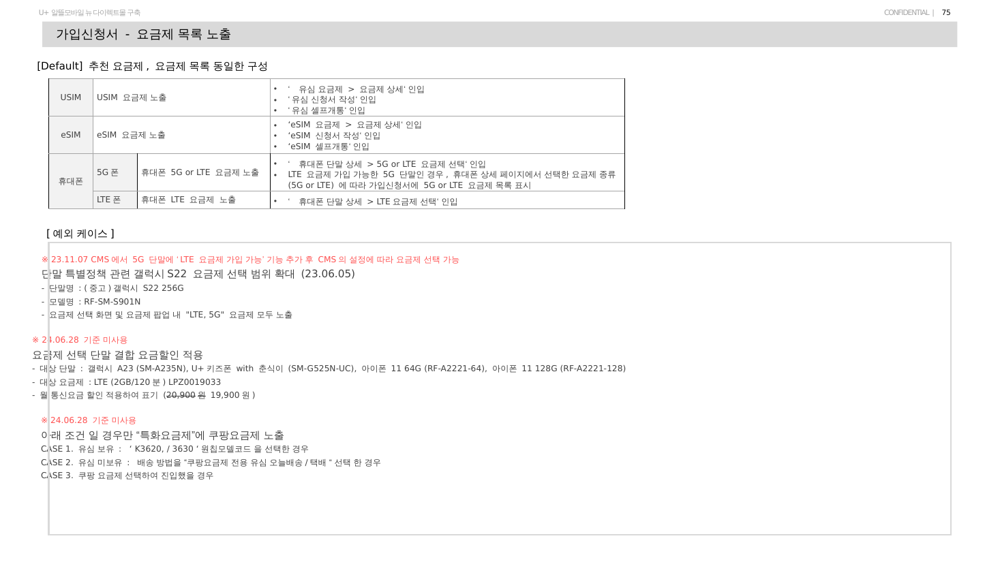

### 1.1 [Default] 추천 요금제 · 요금제 목록 동일한 구성

| 상품 | 단말 구분 | 노출 요금제 | 인입 경로 |
|---|---|---|---|
| **USIM** | — | USIM 요금제 노출 | `유심 요금제 > 요금제 상세` 인입 / `유심 신청서 작성` 인입 / `유심 셀프개통` 인입 |
| **eSIM** | — | eSIM 요금제 노출 | `eSIM 요금제 > 요금제 상세` 인입 / `eSIM 신청서 작성` 인입 / `eSIM 셀프개통` 인입 |
| **휴대폰** | 5G폰 | 휴대폰 5G **or** LTE 요금제 노출 | `휴대폰 단말 상세 > 5G or LTE 요금제 선택` 인입<br>LTE 요금제 가입 가능한 5G 단말인 경우, 휴대폰 상세 페이지에서 선택한 요금제 종류(5G or LTE)에 따라 가입신청서에 5G or LTE 요금제 목록 표시 |
| **휴대폰** | LTE폰 | 휴대폰 LTE 요금제 노출 | `휴대폰 단말 상세 > LTE요금제 선택` 인입 |

### 1.2 [예외 케이스] 3건

**① 5G 단말의 LTE 요금제 가입 (운영 중)**

> ※ 23.11.07 CMS에서 5G 단말에 'LTE 요금제 가입 가능' 기능 추가 후 CMS의 설정에 따라 요금제 선택 가능

단말 특별정책 관련 갤럭시S22 요금제 선택 범위 확대 (23.06.05)

- 단말명 : (중고)갤럭시 S22 256G
- 모델명 : `RF-SM-S901N`
- 요금제 선택 화면 및 요금제 팝업 내 "LTE, 5G" 요금제 모두 노출

**② 단말 결합 요금할인 적용 — ※ 24.06.28 기준 미사용**

- 대상 단말 : 갤럭시 A23 (`SM-A235N`), U+키즈폰 with 춘식이 (`SM-G525N-UC`), 아이폰 11 64G (`RF-A2221-64`), 아이폰 11 128G (`RF-A2221-128`)
- 대상 요금제 : LTE (2GB/120분) `LPZ0019033`
- 월 통신요금 할인 적용하여 표기 (20,900원 → 19,900원)

**③ 쿠팡요금제 노출 조건 — ※ 24.06.28 기준 미사용**

아래 조건일 경우만 "특화요금제"에 쿠팡요금제 노출

- CASE 1. 유심 보유 : `K3620` / `3630` 원칩모델코드를 선택한 경우
- CASE 2. 유심 미보유 : 배송 방법을 "쿠팡요금제 전용 유심 오늘배송/택배" 선택한 경우
- CASE 3. 쿠팡 요금제 선택하여 진입했을 경우

> 원본 표기 그대로 — CASE 1의 두 번째 코드는 `3630`으로 적혀 있습니다(`K` 누락 추정, 원본 미교정).

---

## 2. slide 76 — 요금제 선택 화면 진입 시, 안내 팝업 (신규)

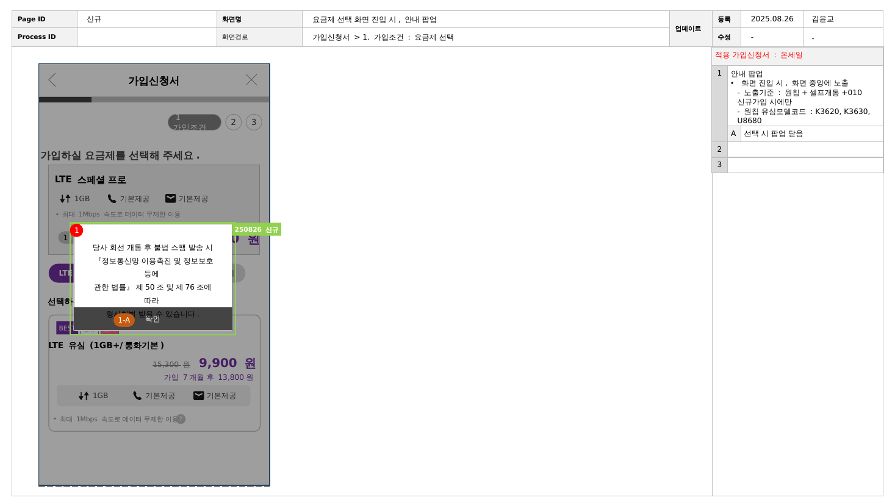

**작성** 2025.08.26 · 김윤교 · **적용 가입신청서 : 온세일**

| 번호 | 정의 |
|---|---|
| **1** | **안내 팝업** — 화면 진입 시, 화면 중앙에 노출<br>· 노출기준 : **원칩 + 셀프개통 + 010 신규가입 시에만**<br>· 원칩 유심모델코드 : `K3620`, `K3630`, `U8680` |
| **1-A** | 선택 시 팝업 닫음 |

### 팝업 문구 (전문)

> 당사 회선 개통 후 불법 스팸 발송 시 『정보통신망 이용촉진 및 정보보호 등에 관한 법률』 제50조 및 제76조에 따라 형사처벌 받을 수 있습니다.

**버튼** — `확인` 단일

### 이 슬라이드의 배경 화면 요소

- 추천 요금제 캐러셀 : `LTE 스페셜 프로` / `49,300 원` → `33,000 원` / 인디케이터 `1 / 3` / 배지 `250826 신규`
- 필터 탭 : `LTE 요금제` · `5G 요금제` · `특화 요금제`
- `선택하신 요금제` 영역
- 카드 : `LTE 유심 (1GB+/통화기본)` / `15,300 원` → `9,900 원` / `가입 7개월 후 13,800원` / `최대 1Mbps 속도로 데이터 무제한 이용` + `?` 버튼 / 배지 `BEST` `신규` `인기`

---

## 3. slide 77 — MO9_0301 요금제 목록 (1/3) : 추천 요금제, 요금제 필터, 요금제 그룹

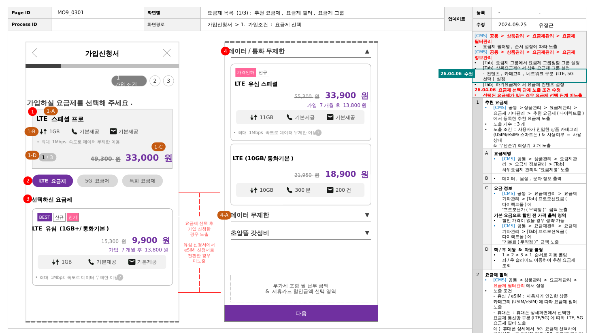

**최종 수정** 2024.09.25 · 유정근

### 3.1 변경 이력 (원본 전문)

| 일자 | 내용 |
|---|---|
| 23.04.10 | 요금제 출력 목록 UI 변경 |
| 23.05.08 | 단말 결합 요금할인 적용 |
| 23.06.05 | 단말 특별정책 관련 갤럭시S22 요금제 선택 범위 확대 |
| 23.06.29 | 가입신청서 작성 - 요금제 선택 정보 제공 영역 추가 요청 |
| 23.07.19 | 유플러스 쿠팡제휴요금제 출시 관련 기능 개발 |
| 23.11.07 | 5G 단말에 "LTE 요금제 가입" 가능 관련 휴대폰 단말 상세페이지 요금제 선택에 따라 가입신청서 요금제 목록 표시 |
| 24.01.05 | 가격 프로모션 안내 문구 추가 |
| 24.06.28 | 요금제 영역 UI 개선 — 추천 요금제 영역 상단 영역으로 UI 변경 / 상위요금제명 노출 영역 > 요금제 그룹명으로 노출되도록 개선 |
| 24.09.25 | 선택하신 요금제 영역 노출 조건 수정 |
| 25.01.24 | 유심·이심 요금제 통합 / 노출기준 이심 유심 요금제 선택 → 상품 선택 |
| **26.04.06** | **[가입신청서 전환률 개선] 요금제 선택 구간 개선** |

> **26.04.06 행이 본 프로젝트(S-02 개선)입니다.** 원본에 이미 반영 예정으로 기록되어 있습니다.

### 3.2 CMS 연동 (헤더)

```
[CMS] 공통 > 상품관리 > 요금제관리 > 요금제 필터관리
  요금제 필터명, 순서 설정에 따라 노출
[CMS] 공통 > 상품관리 > 요금제관리 > 요금제 정보관리
  [Tab] 요금제 그룹에서 요금제 그룹핑할 그룹 설정
  [Tab] 상위요금제에서 상위 요금제 그룹 설정
        - 컨텐츠, 카테고리, 네트워크 구분 (LTE, 5G 선택) 설정
  [Tab] 하위요금제에서 요금제 컨텐츠 설정
26.04.06 요금제 선택 단계 노출 조건 수정
  선택된 요금제가 있는 경우 요금제 선택 단계 미노출
```

### 3.3 영역 정의

| 번호 | 영역 | 정의 |
|---|---|---|
| **1** | **추천 요금제** | `[CMS] 공통 > 상품관리 > 요금제관리 > 요금제 기타관리 > 추천 요금제(다이렉트몰)`에서 등록한 추천 요금제 노출<br>· **노출 개수 : 3개**<br>· 노출 조건 : 사용자가 인입한 상품 카테고리(USIM/eSIM/스마트폰) **&** 사용여부 = 사용 상태 **&** 우선순위 최상위 3개 노출 |
| 1-A | 요금제명 | `[CMS] 공통 > 상품관리 > 요금제관리 > 요금제 정보관리 > [Tab]하위요금제 관리`의 "요금제명" 노출 |
| 1-B | 데이터·음성·문자 | 데이터, 음성, 문자 정보 출력 |
| 1-C | 요금 정보 | `[CMS] 공통 > 요금제관리 > 요금제 기타관리 > [Tab]프로모션요금(다이렉트몰)`에 **"프로모션가(무약정)"** 금액 노출<br>기본 요금으로 **할인 전 가격 출력 영역** / **할인 가격이 없을 경우 생략 가능**<br>같은 경로의 **"기본료(무약정)"** 금액 노출 |
| 1-D | 좌/우 이동 & 자동 롤링 | `1 > 2 > 3 > 1` 순서로 자동 롤링 / 좌·우 슬라이드 이동하여 추천 요금제 조회 |
| **2** | **요금제 필터** | `[CMS] 공통 > 상품관리 > 요금제관리 > 요금제 필터관리`에서 설정<br>· 노출 조건 — **유심 / eSIM** : 사용자가 인입한 상품 카테고리(USIM/eSIM)에 따라 요금제 필터 노출<br>· **휴대폰** : 휴대폰 상세화면에서 선택한 요금제 통신망 구분(LTE/5G)에 따라 LTE, 5G 요금제 필터 노출<br>　예) 휴대폰 상세에서 5G 요금제 선택하여 가입신청서로 진입한 경우 **'5G 요금제' 필터만 노출** |
| **3** | **선택하신 요금제** | 요금제 목록에서 선택 시, 선택하신 요금제에 노출<br>유심/eSIM/휴대폰 요금제 상세 화면에서 '가입하기' 버튼을 클릭하여 가입신청서로 진입한 경우 선택한 요금제로 노출<br>**'24.09.25 선택하신 요금제 노출 조건 수정** — 유심 요금제에서 eSIM 신청서로 전환한 경우 '선택하신 요금제' **미노출** |
| **4** | **요금제 그룹** | `[CMS] 공통 > 상품관리 > 요금제관리 > 요금제정보 관리 > [Tab]요금제 그룹`에서 설정<br>· 사용자가 인입한 상품 카테고리(USIM/eSIM/스마트폰) **&** 선택한 요금제 필터 **&** 사용여부 = 사용 상태 요금제 그룹 노출<br>· 우선순위 설정 팝업에서 설정한 노출 순서에 따라 그룹 노출<br>· **Default : 노출 순서가 첫번째인 그룹 펼침** |
| 4-A | 요금제 그룹 접기 | 그룹 접기/펼치기로 요금제 목록 조회<br>**Default : 첫번째 그룹을 제외한 다른 그룹은 접기 상태** |

### 3.4 화면 주석 (도형)

- `선택하신 요금제` 옆 주석 : **요금제 선택 후 가입 신청한 경우 노출** / **유심 신청서에서 eSIM 신청서로 전환한 경우 미노출**
- 요금제 그룹명 예시 : `데이터/통화 무제한` · `데이터 무제한` · `초알뜰 갓성비` (그룹 헤더 ▲/▼ 토글)
- 하단 고정 영역 자리 표시 : `부가세 포함 월 납부 금액 & 제휴카드 할인금액 선택 영역`

---

## 4. slide 78 — MO9_0301 요금제 목록 (2/3) : 요금제 정보

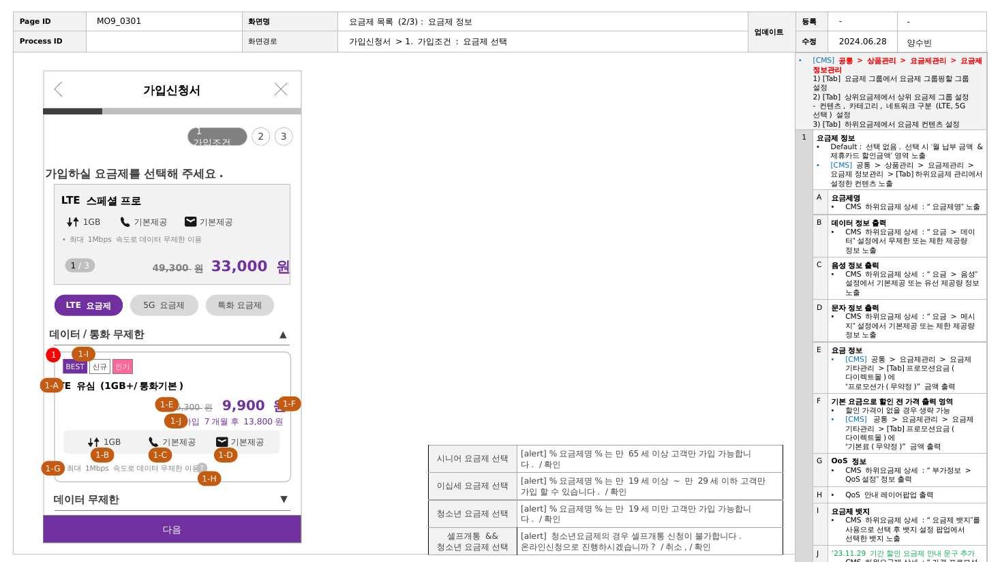

**최종 수정** 2024.06.28 · 양수빈

### 4.1 CMS 연동 (헤더)

```
[CMS] 공통 > 상품관리 > 요금제관리 > 요금제 정보관리
 1) [Tab] 요금제 그룹에서 요금제 그룹핑할 그룹 설정
 2) [Tab] 상위요금제에서 상위 요금제 그룹 설정
    - 컨텐츠, 카테고리, 네트워크 구분 (LTE, 5G 선택) 설정
 3) [Tab] 하위요금제에서 요금제 컨텐츠 설정
```

### 4.2 카드 요소 정의

| 번호 | 요소 | 정의 |
|---|---|---|
| **1** | **요금제 정보** | **Default : 선택 없음.** 선택 시 **'월 납부 금액 & 제휴카드 할인금액' 영역 노출**<br>`[CMS] … > [Tab]하위요금제 관리`에서 설정한 컨텐츠 노출 |
| 1-A | 요금제명 | CMS 하위요금제 상세 : "요금제명" 노출 |
| 1-B | 데이터 정보 출력 | CMS 하위요금제 상세 : "요금 > 데이터" 설정에서 **무제한 또는 제한 제공량** 정보 노출 |
| 1-C | 음성 정보 출력 | CMS 하위요금제 상세 : "요금 > 음성" 설정에서 **기본제공 또는 유선 제공량** 정보 노출 |
| 1-D | 문자 정보 출력 | CMS 하위요금제 상세 : "요금 > 메시지" 설정에서 **기본제공 또는 제한 제공량** 정보 노출 |
| 1-E | 요금 정보 | `[CMS] 공통 > 요금제관리 > 요금제 기타관리 > [Tab]프로모션요금(다이렉트몰)`에 **"프로모션가(무약정)"** 금액 출력 |
| 1-F | 기본 요금 | **할인 전 가격 출력 영역 / 할인 가격이 없을 경우 생략 가능**<br>같은 경로의 **"기본료(무약정)"** 금액 출력 |
| 1-G | QoS 정보 | CMS 하위요금제 상세 : "부가정보 > QoS설정" 정보 출력 <sup>원본 표기 `OoS` — 오타</sup> |
| 1-H | QoS 안내 | **레이어팝업 출력** |
| 1-I | 요금제 뱃지 | CMS 하위요금제 상세 : "요금제 뱃지"를 사용으로 선택 후 **뱃지 설정 팝업에서 선택한 뱃지 노출** |
| 1-J | 가격 프로모션 안내 문구 | **'23.11.29 기간 할인 요금제 안내 문구 추가**<br>CMS 하위요금제 상세 : "가격 프로모션 안내" 텍스트 출력<br>**안내가 등록된 경우에만 노출되며, 전체 가격 영역과 동일한 높이 유지** |

### 4.3 요금제 선택 시 Alert 4종 (문구 전문)

| 조건 | Alert 문구 | 버튼 |
|---|---|---|
| **시니어 요금제 선택** | `[alert] %요금제명%는 만 65세 이상 고객만 가입 가능합니다.` | 확인 |
| **이십세 요금제 선택** | `[alert] %요금제명%는 만 19세 이상 ~ 만 29세 이하 고객만 가입 할 수 있습니다.` | 확인 |
| **청소년 요금제 선택** | `[alert] %요금제명%는 만 19세 미만 고객만 가입 가능합니다.` | 확인 |
| **셀프개통 && 청소년 요금제 선택** | `[alert] 청소년요금제의 경우 셀프개통 신청이 불가합니다.`<br>`온라인신청으로 진행하시겠습니까?` | 취소 / 확인 |

> `%요금제명%`은 원본의 치환 변수 표기입니다.

### 4.4 카드 렌더 예시 (원본 목업 값)

```
[배지] BEST  신규  인기
LTE 유심 (1GB+/통화기본)
15,300 원  →  9,900 원
가입 7개월 후 13,800원
최대 1Mbps 속도로 데이터 무제한 이용   [?]
데이터 1GB / 음성 기본제공 / 문자 기본제공
```

---

## 5. slide 79 — MO9_0301 요금제 목록 (3/3) : 월 납부금액 & 제휴카드 할인금액 하단 고정 영역

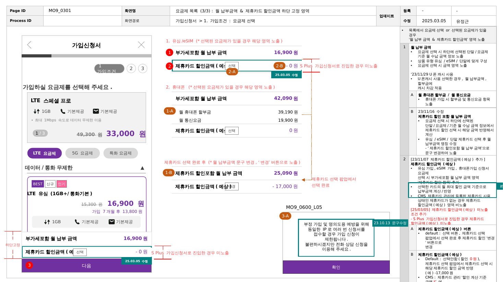

**최종 수정** 2025.03.05 · 유정근

### 5.1 변경 이력 (3/3 고유 항목)

| 일자 | 내용 |
|---|---|
| 23.11.07 | **제휴카드 할인 금액(예상) 추가** |
| 25.01.07 | 대리점 온라인 시스템 구축 |
| 25.03.05 | **S Plus 가입신청서 제휴카드 할인금액(예상) 미노출 조건 추가** |

*(그 외 항목은 slide 77 변경 이력과 동일)*

### 5.2 노출 조건 (헤더)

> 목록에서 요금제 선택 or **선택된 요금제가 있을 경우** '월 납부 금액 & 제휴카드 할인금액' 영역 노출

### 5.3 영역 정의

| 번호 | 영역 | 정의 |
|---|---|---|
| **1** | **월 납부 금액** | 요금제 선택 시 하단에 **선택된 단말/요금제 기준 월 수납 금액** 정보 노출<br>상품 유형 **유심 / eSIM / 단말**에 맞게 구성 · 요금제 선택 시 금액 영역 노출<br>**'23/11/29 U폰 캐시 사용** — U폰캐시 사용 선택한 경우, 월 납부금액·할부금에 캐시 차감 적용 |
| 1-A | 월 휴대폰 할부금 / 월 통신요금 | **휴대폰 가입 시** 할부금 및 통신요금 항목 노출 |
| 1-B | 제휴카드 할인 포함 월 납부 금액 | **23/11/16 수정**<br>요금제 선택 시 하단에 선택된 단말/요금제 기준 월 수납 금액 정보에서 **제휴카드 할인 선택 시 해당 금액 반영해서 계산**<br>유심 / eSIM / 단말 **제휴카드 선택 후 월 납부금액 명칭 수정** — **'제휴카드 할인포함 월 납부 금액'으로 문구 변경**하여 노출 |
| **2** | **제휴카드 할인금액 (예상)** | **[23/11/07 추가]** 유심 가입, eSIM 가입, 휴대폰 가입 신청서 요금제 선택 시 **부가세포함 월 납부 금액 영역에 '제휴카드 할인 항목' 추가**<br>**선택한 카드의 월 최대 할인 금액 기준**으로 납부금액 계산/반영<br>CMS 제휴카드 관리에 등록된 **사용 상태인 제휴카드가 없는 경우 영역 비노출**<br>**[25/03/05] 미노출 조건 추가** — **S Plus 가입신청서로 진입한 경우 미노출** |
| 2-A | 제휴카드 할인금액(예상) 버튼 | **default : `선택` 버튼**, 제휴카드 선택 팝업에서 선택 완료 후 제휴카드 할인 **`변경` 버튼으로 변경** |
| 2-B | 제휴카드 할인금액(예상) 값 | **Default : 선택안함(할인 0원)**, 제휴카드 선택 팝업에서 제휴카드 선택 시 해당 제휴카드 할인 금액 반영 (예) `-17,000원`<br>CMS : 제휴카드 관리 **'할인 계산 기준 금액*'**에 입력한 금액 호출 |
| **3** | **다음 BTN** | **다음** : `[bottomsheet]사은품선택 MO9_0302`<br>**이전** : `[링크]가입유형선택 MO9_0800`<br>**LTE 15G 요금제 선택할 경우 (망내1회선)** : `[bottomsheet]LG U+망 1회선 번호지정`<br>**NPay 요금제 선택 시** : `[bottomsheet]네이버인증`<br>**'25/01/07 수정** — 아래 POS 코드로 작성된 신청서인 경우 **사은품 선택 bottomsheet 미노출**<br>　· `P403513` (고고_주식회사 아정네트웍스)<br>　· `P685974` (고고_홈페이지)<br>　· `P824432` (고고_노란마켓 수원점)<br>　· `P532875` (고고_제이디엠) |
| 3-A | 동일 IP 다회선 제한 | **동일한 IP로 4회선 초과 신청 시**<br>· 가입유형 : **신규**<br>· 신청서 상태 : **신청대기 / 개통대기 / 개통완료** (임시저장, 가입취소는 제외)<br>· 검색 기간 설정 : **최근 3개월**<br>· 신청서 작성 건수 **4개 초과**<br>→ **확인 : 가입신청서 창닫기** |

> 3-A 팝업의 화면 코드는 `MO9_0600_L05`로 표기돼 있습니다.
> 사은품 bottomsheet 코드가 본문에는 `MO9_0302`, 실제 사은품 슬라이드(89p)에는 `MO9_0301_L01`로 표기돼 **원본 내에서 불일치**합니다.

### 5.4 동일 IP 제한 팝업 문구 (전문 · 23.10.13 문구수정)

> 부정 가입 및 명의도용 예방을 위해 동일한 IP로 여러 번 신청서를 접수할 경우 가입 신청이 제한됩니다.
> 불편하시겠지만 전화 상담 신청을 이용해 주세요.

### 5.5 하단 고정 영역 목업 값 (원본 표기 그대로)

**1. 유심 / eSIM** *(선택된 요금제가 있을 경우 해당 영역 노출)*

| 항목 | 값 |
|---|---|
| 부가세포함 월 납부 금액 | 16,900원 |
| 제휴카드 할인금액(예상) | - 0원 &nbsp;&nbsp;`[선택]` |

**2. 휴대폰** *(선택된 요금제가 있을 경우 해당 영역 노출)*

| 항목 | 값 |
|---|---|
| 부가세포함 월 납부 금액 | 42,090원 |
| 월 휴대폰 할부금 / 월 통신요금 | 39,190원 / 19,900원 |
| 제휴카드 할인금액(예상) | 0원 |

**제휴카드 선택 완료 후** *(월 납부금액 문구 변경, '변경' 버튼으로 노출)*

| 항목 | 값 |
|---|---|
| **제휴카드 할인포함** 월 납부 금액 | 25,090원 |
| 제휴카드 할인금액(예상) | - 17,000원 &nbsp;&nbsp;`[변경]` |

> 원본 목업의 숫자는 서로 다른 케이스에서 발췌된 값이라 **합산이 맞지 않습니다**(예: 42,090 ≠ 39,190 + 19,900). 원본 표기 그대로 옮겼습니다.

---

## 6. slide 80 · 81 — MO9_0301_틴즈클럽 : 갤럭시 틴즈 요금제

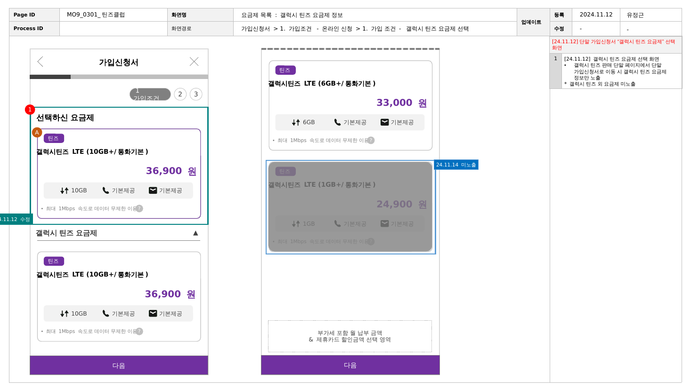

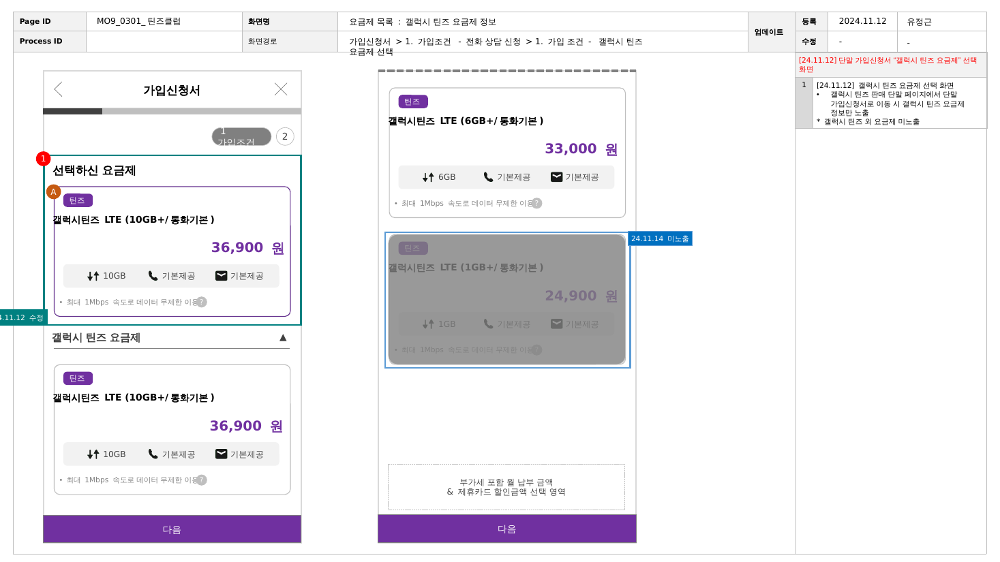

**최종 수정** 2024.11.12 · 유정근
**80p = 온라인 신청** (스텝 `1 가입조건 · 2 · 3`) / **81p = 전화 상담 신청** (스텝 `1 가입조건 · 2`)

### 6.1 변경 이력

| 일자 | 내용 |
|---|---|
| 24.11.12 | 갤럭시 틴즈 요금제 출력 목록 UI 변경 |
| 24.11.14 | 갤럭시 틴즈 **LTE (1GB+/통화기본) 요금제 미노출** 수정 |

### 6.2 정의

| 번호 | 정의 |
|---|---|
| **1** | **[24.11.12] 갤럭시 틴즈 요금제 선택 화면**<br>갤럭시 틴즈 판매 단말 페이지에서 단말 가입신청서로 이동 시 **갤럭시 틴즈 요금제 정보만 노출**<br>**\* 갤럭시 틴즈 외 요금제 미노출** |
| 1-A | `선택하신 요금제` 영역 |

### 6.3 요금제 목록 (원본 목업 값)

| 요금제명 | 데이터 | 음성 | 문자 | 금액 | 비고 |
|---|---|---|---|---|---|
| 갤럭시틴즈 LTE (10GB+/통화기본) | 10GB | 기본제공 | 기본제공 | 36,900 원 | |
| 갤럭시틴즈 LTE (10GB+/통화기본) | 10GB | 기본제공 | 기본제공 | 33,000 원 | |
| 갤럭시틴즈 LTE (6GB+/통화기본) | 6GB | 기본제공 | 기본제공 | 24,900 원 | |
| 갤럭시틴즈 LTE (1GB+/통화기본) | 1GB | 기본제공 | 기본제공 | 36,900 원 | **24.11.14 미노출** |

- 그룹명 : `갤럭시 틴즈 요금제` (▲ 펼침)
- 모든 카드 공통 : `최대 1Mbps 속도로 데이터 무제한 이용` + `?` 버튼
- **요금제 필터 탭이 없습니다** — 틴즈 요금제 그룹 하나만 노출됩니다

---

## 7. slide 82 — [팝업] 제휴카드 할인 계산해보기 (`MO9_0301_P01`)

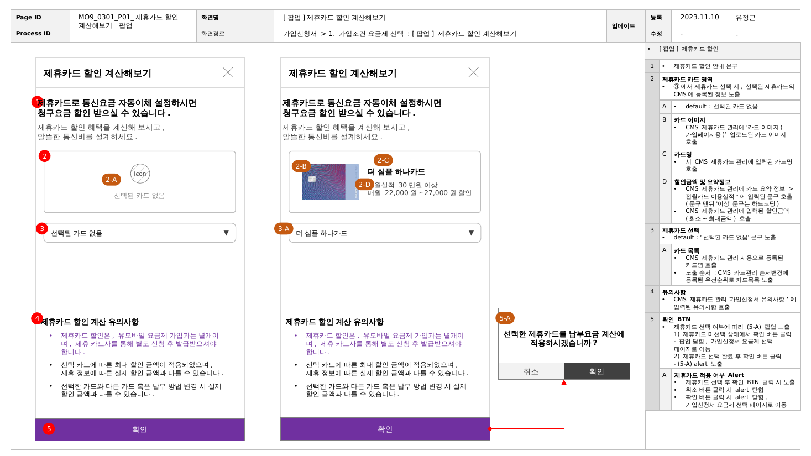

**최종 수정** 2023.11.10 · 유정근 · **변경 이력** 23.11.10 제휴카드 할인 팝업 추가

**팝업 타이틀** — `제휴카드 할인 계산해보기`

### 7.1 영역 정의

| 번호 | 영역 | 정의 |
|---|---|---|
| **1** | 제휴카드 할인 **안내 문구** | (아래 7.2 전문) |
| **2** | **제휴카드 카드 영역** | ③에서 제휴카드 선택 시, **선택된 제휴카드의 CMS에 등록된 정보 노출** |
| 2-A | — | **default : 선택된 카드 없음** |
| 2-B | 카드 이미지 | CMS 제휴카드 관리에 **'카드 이미지(가입페이지용)'** 업로드된 카드 이미지 호출 |
| 2-C | 카드명 | CMS 제휴카드 관리에 입력된 **카드명** 호출 |
| 2-D | 할인금액 및 요약정보 | CMS 제휴카드 관리에 **카드 요약 정보 > 전월카드 이용실적\***에 입력된 문구 호출<br>**(문구 맨뒤 '이상' 문구는 하드코딩)**<br>CMS 제휴카드 관리에 입력된 **할인금액(최소~최대금액)** 호출 |
| **3** | **제휴카드 선택** | **default : '선택된 카드 없음' 문구 노출** (셀렉트 `▼`) |
| 3-A | 카드 목록 | CMS 제휴카드 관리 **사용으로 등록된 카드명** 호출<br>노출 순서 : CMS 카드관리 **순서변경에 등록된 우선순위**로 카드목록 노출 |
| **4** | **유의사항** | CMS 제휴카드 관리 **'가입신청서 유의사항'**에 입력된 유의사항 호출 |
| **5** | **확인 BTN** | 제휴카드 선택 여부에 따라 (5-A) 팝업 노출<br>1) **제휴카드 미선택 상태**에서 확인 버튼 클릭 → 팝업 닫힘, 가입신청서 요금제 선택 페이지로 이동<br>2) **제휴카드 선택 완료 후** 확인 버튼 클릭 → **(5-A) alert 노출** |
| 5-A | 제휴카드 적용 여부 Alert | 제휴카드 선택 후 확인 BTN 클릭 시 노출<br>**취소** 버튼 클릭 시 alert 닫힘<br>**확인** 버튼 클릭 시 alert 닫힘, 가입신청서 요금제 선택 페이지로 이동 |

### 7.2 안내 문구 (전문 · 영역 1)

> 제휴카드로 통신요금 자동이체 설정하시면 청구요금 할인 받으실 수 있습니다.
> 제휴카드 할인 혜택을 계산해 보시고, 알뜰한 통신비를 설계하세요.

### 7.3 유의사항 (전문 · 영역 4)

**소제목** — `제휴카드 할인 계산 유의사항`

> · 제휴카드 할인은, 유모바일 요금제 가입과는 별개이며, 제휴 카드사를 통해 별도 신청 후 발급받으셔야 합니다.
> · 선택 카드에 따른 최대 할인 금액이 적용되었으며, 제휴 정보에 따른 실제 할인 금액과 다를 수 있습니다.
> · 선택한 카드와 다른 카드 혹은 납부 방법 변경 시 실제 할인 금액과 다를 수 있습니다.

### 7.4 5-A Alert 문구 (전문)

> 선택한 제휴카드를 납부요금 계산에 적용하시겠습니까?

**버튼** — `취소` / `확인`

### 7.5 카드 정보 표기 예시 (원본 목업 값)

```
[카드 이미지]  더 심플 하나카드
               전월실적 30만원 이상
               매월 22,000원~27,000원 할인
```

**미선택 상태** — 카드 영역 `선택된 카드 없음`, 셀렉트 `선택된 카드 없음 ▼`
**선택 상태** — 셀렉트 `더 심플 하나카드 ▼`

---

## 8. slide 83 — S Plus - 요금제 선택

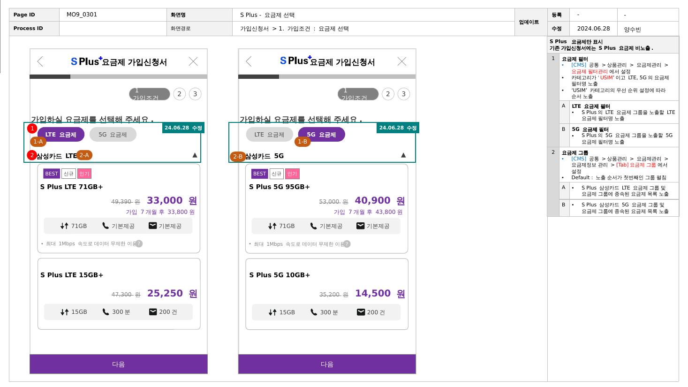

**최종 수정** 2024.06.28 · 양수빈

### 8.1 변경 이력

| 일자 | 내용 |
|---|---|
| 23.09.25 | S Plus 요금제 가입 시 요금제 선택 제한 |
| 24.01.05 | 가격 프로모션 안내 문구 추가 |
| 24.06.28 | 요금제 영역 UI 개선 — **S Plus 하드코딩된 필터 삭제. 요금제 그룹명으로 노출되도록 개선** |

### 8.2 노출 원칙 (헤더)

> **S Plus 요금제만 표시** / 기존 가입신청서에는 **S Plus 요금제 비노출**

### 8.3 영역 정의

| 번호 | 영역 | 정의 |
|---|---|---|
| **1** | 요금제 필터 | `[CMS] 공통 > 상품관리 > 요금제관리 > 요금제 필터관리`에서 설정<br>**카테고리가 'USIM'이고 LTE, 5G의 요금제 필터명 노출**<br>'USIM' 카테고리의 **우선 순위 설정에 따라 순서 노출** |
| 1-A | LTE 요금제 필터 | S Plus의 **LTE 요금제 그룹**을 노출할 LTE 요금제 필터명 노출 |
| 1-B | 5G 요금제 필터 | S Plus의 **5G 요금제 그룹**을 노출할 5G 요금제 필터명 노출 |
| **2** | 요금제 그룹 | `[CMS] … > [Tab]요금제 그룹`에서 설정 · **Default : 노출 순서가 첫번째인 그룹 펼침** |
| 2-A | — | **S Plus 삼성카드 LTE 요금제 그룹** 및 요금제 그룹에 종속된 요금제 목록 노출 |
| 2-B | — | **S Plus 삼성카드 5G 요금제 그룹** 및 요금제 그룹에 종속된 요금제 목록 노출 |

### 8.4 요금제 목록 (원본 목업 값)

**삼성카드 LTE 그룹**

| 요금제명 | 데이터 | 음성 | 문자 | 금액 | 프로모션 문구 |
|---|---|---|---|---|---|
| S Plus LTE 71GB+ | 71GB | 300분 | 기본제공 | 49,390 원 → 33,000 원 | 가입 7개월 후 33,800원 |
| S Plus LTE 15GB+ | 15GB | 기본제공 | 200건 | 47,300 원 → 25,250 원 | — |

**삼성카드 5G 그룹**

| 요금제명 | 데이터 | 음성 | 문자 | 금액 | 프로모션 문구 |
|---|---|---|---|---|---|
| S Plus 5G 95GB+ | 71GB | 300분 | 기본제공 | 53,000 원 → 40,900 원 | 가입 7개월 후 43,800원 |
| S Plus 5G 10GB+ | 15GB | 기본제공 | 200건 | 35,200 원 → 14,500 원 | — |

> 요금제명(95GB+/10GB+)과 데이터 표기(71GB/15GB)가 원본 목업에서 서로 어긋납니다. 원본 표기 그대로입니다.

> **연계** — slide 79 `[25/03/05]` : **S Plus 가입신청서로 진입한 경우 제휴카드 할인금액(예상) 미노출**

---

## 9. slide 84 — 유독할인 요금제 변경 안내 팝업

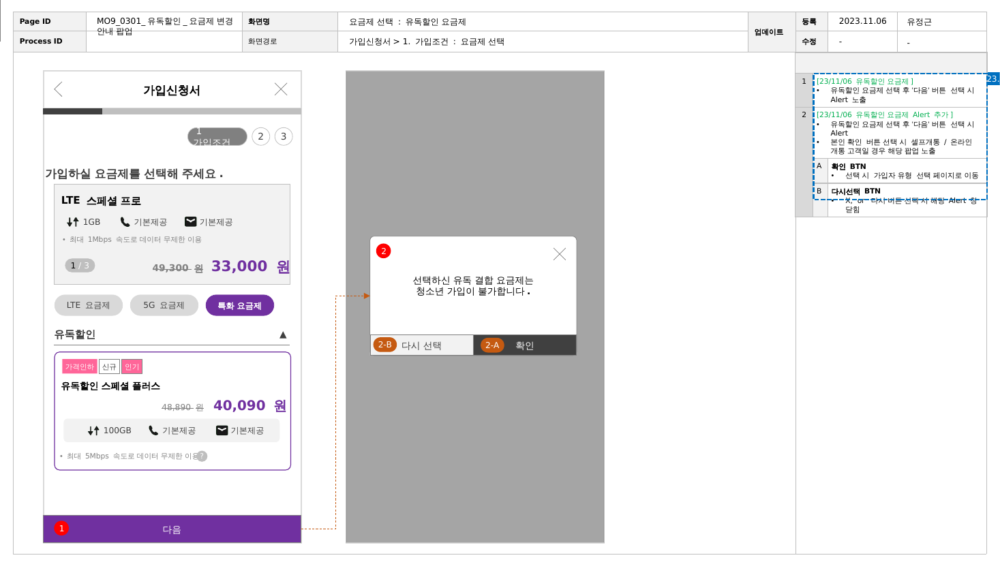

**최종 수정** 2023.11.06 · 유정근 · **변경 이력** 23.11.07 유독할인 요금제 가입 시 청소년 가입불가 Alert 노출

| 번호 | 정의 |
|---|---|
| **1** | **[23/11/06 유독할인 요금제]** 유독할인 요금제 선택 후 **'다음' 버튼 선택 시 Alert 노출** |
| **2** | **[23/11/06 유독할인 요금제 Alert 추가]** 유독할인 요금제 선택 후 '다음' 버튼 선택 시 Alert<br>**본인 확인 버튼 선택 시 셀프개통 / 온라인 개통 고객일 경우 해당 팝업 노출** |
| 2-A | **확인 BTN** — 선택 시 **가입자 유형 선택 페이지로 이동** |
| 2-B | **다시선택 BTN** — `X` 또는 `다시` 버튼 선택 시 해당 Alert 창 닫힘 |

### Alert 문구 (전문)

> 선택하신 유독 결합 요금제는 청소년 가입이 불가합니다.

**버튼** — `다시 선택` / `확인`

### 요금제 목업 값

```
[배지] 가격인하  신규  인기
유독할인 스페셜 플러스        (그룹명: 유독할인)
48,890 원  →  40,090 원
최대 5Mbps 속도로 데이터 무제한 이용   [?]
데이터 100GB / 음성 기본제공 / 문자 기본제공
```

---

## 10. slide 85 — 데이터 0GB 차단 : 셀프개통 불가 Alert

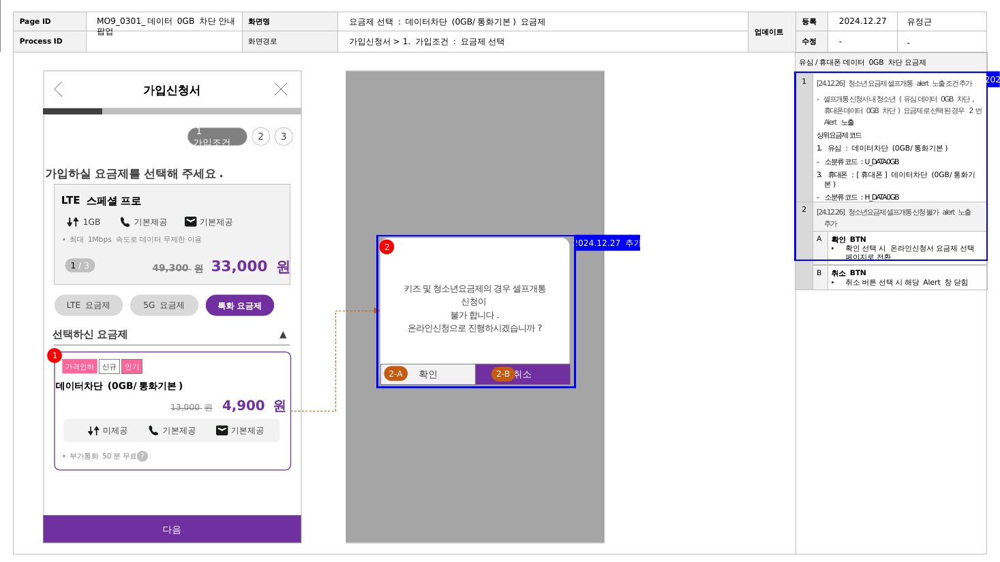

**최종 수정** 2024.12.27 · 유정근
**변경 이력** 24.12.27 가입신청서 청소년 요금제 선택 시 **셀프개통 불가 Alert 노출 조건 추가**

| 번호 | 정의 |
|---|---|
| **1** | **[24.12.26] 청소년 요금제 셀프개통 alert 노출 조건 추가**<br>**셀프개통 신청서** 내 청소년(유심 데이터 0GB 차단, 휴대폰 데이터 0GB 차단) 요금제로 선택된 경우 **2번 Alert 노출**<br>**상위요금제 코드**<br>1. 유심 : `데이터차단 (0GB/통화기본)` — 소분류 코드 `U_DATA0GB`<br>3. 휴대폰 : `[휴대폰] 데이터차단 (0GB/통화기본)` — 소분류 코드 `H_DATA0GB` |
| **2** | **[24.12.26] 청소년요금제 셀프개통 신청 불가 alert 노출 추가** |
| 2-A | **확인 BTN** — 확인 선택 시 **온라인신청서 요금제 선택 페이지로 전환** |
| 2-B | **취소 BTN** — 취소 버튼 선택 시 해당 Alert 창 닫힘 |

> 원본에 상위요금제 코드가 **1 · 3**으로 번호가 매겨져 있고 2번이 없습니다(원본 미교정).
> 본문 날짜는 `24.12.26`, 이력·헤더 날짜는 `24.12.27`로 원본 내에서 하루 차이가 납니다.

### Alert 문구 (전문)

> 키즈 및 청소년요금제의 경우 셀프개통 신청이 불가 합니다.
> 온라인신청으로 진행하시겠습니까?

**버튼** — `확인` / `취소` *(원본 배치 순서: 확인이 좌측, 취소가 우측)*

### 요금제 목업 값

```
데이터차단 (0GB/통화기본)
13,000 원  →  4,900 원
부가통화 50분 무료   [?]
데이터 미제공 / 음성 기본제공 / 문자 기본제공
```

---

## 11. slide 86 — 데이터 0GB 차단 : 상담사 개통 안내 Alert

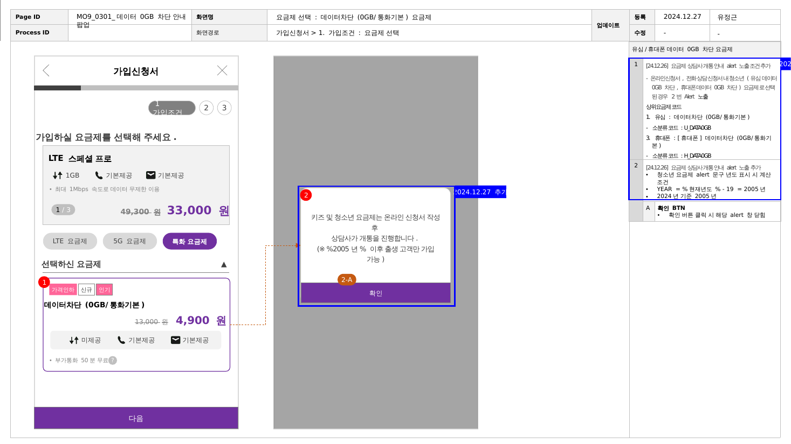

**최종 수정** 2024.12.27 · 유정근
**변경 이력** 24.12.27 가입신청서 청소년 요금제 선택 시 **상담사 개통 안내 Alert 노출 조건 추가**

| 번호 | 정의 |
|---|---|
| **1** | **[24.12.26] 요금제 상담사 개통 안내 alert 노출 조건 추가**<br>**온라인신청서, 전화 상담 신청서** 내 청소년(유심 데이터 0GB 차단, 휴대폰 데이터 0GB 차단) 요금제로 선택된 경우 **2번 Alert 노출**<br>상위요금제 코드 — 유심 `U_DATA0GB` / 휴대폰 `H_DATA0GB` (10절과 동일) |
| **2** | **[24.12.26] 요금제 상담사 개통 안내 alert 노출 추가**<br>**청소년 요금제 alert 문구 년도 표시 시 계산 조건**<br>`YEAR = %현재년도% - 19 = 2005년` (2024년 기준 2005년) |
| 2-A | **확인 BTN** — 확인 버튼 클릭 시 해당 alert 창 닫힘 |

### Alert 문구 (전문)

> 키즈 및 청소년 요금제는 온라인 신청서 작성 후 상담사가 개통을 진행합니다.
> (※ %2005년% 이후 출생 고객만 가입 가능)

**버튼** — `확인` 단일

> **10절과 11절의 차이** — 같은 요금제·같은 조건이지만 **진입한 신청서 종류**로 갈립니다.
> · **셀프개통 신청서** → 10절 (셀프개통 불가 · 온라인신청 전환 확인 · 2버튼)
> · **온라인신청서 / 전화 상담 신청서** → 11절 (상담사 개통 안내 · 1버튼)

---

## 12. slide 87 — 실손약정 플랜 가입 안내 팝업

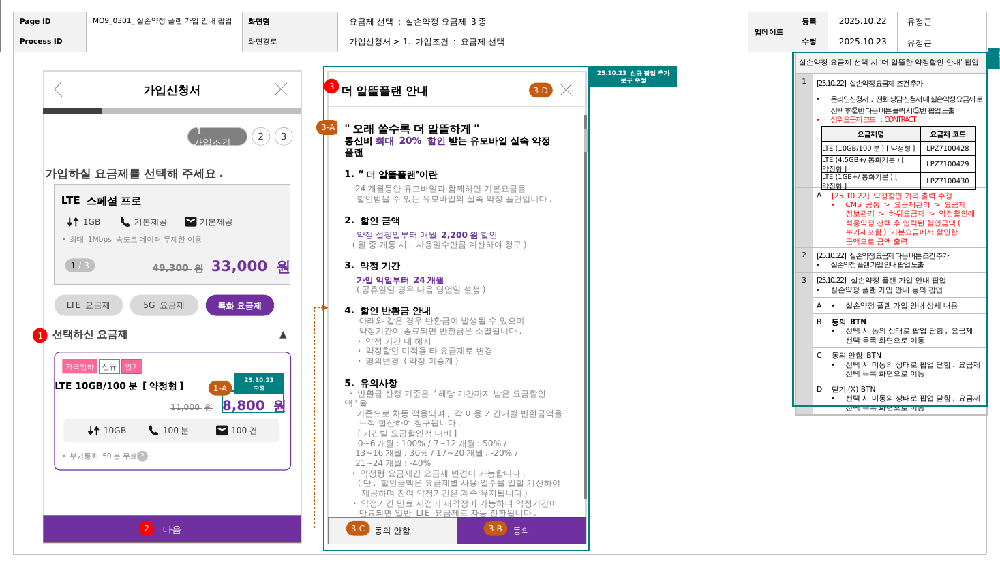

**작성** 2025.10.22 · **수정** 2025.10.23 · 유정근
**변경 이력** 25.10.23 가입신청서 실손약정 요금제 선택 시 '실손약정 플랜 가입안내' 노출 조건 추가

### 12.1 대상 요금제 — 상위요금제 코드 `CONTRACT`

| 요금제명 | 요금제 코드 |
|---|---|
| LTE (10GB/100분) [약정형] | `LPZ7100428` |
| LTE (4.5GB+/통화기본) [약정형] | `LPZ7100429` |
| LTE (1GB+/통화기본) [약정형] | `LPZ7100430` |

### 12.2 정의

| 번호 | 정의 |
|---|---|
| **1** | **[25.10.22] 실손약정 요금제 조건 추가**<br>**온라인신청서, 전화 상담 신청서** 내 실손약정 요금제로 선택 후 **②번 다음 버튼 클릭 시 ③번 팝업 노출** |
| 1-A | **[25.10.22] 약정할인 가격 출력 수정**<br>`CMS 공통 > 요금제관리 > 요금제 정보관리 > 하위요금제 > 약정할인`에 **적용약정 선택 후 입력된 할인금액(부가세포함)**을 **기본요금에서 할인한 금액**으로 금액 출력 |
| **2** | **[25.10.22] 실손약정 요금제 다음 버튼 조건 추가** — 실손약정 플랜 가입 안내 팝업 노출 |
| **3** | **[25.10.22] 실손약정 플랜 가입 안내 팝업** — 실손약정 플랜 가입 안내 **동의 팝업** |
| 3-A | 실손약정 플랜 가입 안내 **상세 내용** |
| 3-B | **동의 BTN** — 선택 시 **동의 상태**로 팝업 닫힘, 요금제 선택 목록 화면으로 이동 |
| 3-C | **동의 안함 BTN** — 선택 시 **미동의 상태**로 팝업 닫힘, 요금제 선택 목록 화면으로 이동 |
| 3-D | **닫기(X) BTN** — 선택 시 **미동의 상태**로 팝업 닫힘, 요금제 선택 목록 화면으로 이동 |

**금액 출력 예시** — `LTE 10GB/100분 [약정형]` `11,000 원` → `8,800 원` (25.10.23 수정)

### 12.3 팝업 본문 (전문) — 타이틀 `더 알뜰플랜 안내`

> **"오래 쓸수록 더 알뜰하게"**
> 통신비 최대 20% 할인 받는 유모바일 실속 약정 플랜
>
> **1. "더 알뜰플랜"이란**
> 24개월동안 유모바일과 함께하면 기본요금을 할인받을 수 있는 유모바일의 실속 약정 플랜입니다.
>
> **2. 할인 금액**
> 약정 설정일부터 매월 2,200원 할인
> (월 중 개통 시, 사용일수만큼 계산하여 청구)
>
> **3. 약정 기간**
> 가입 익일부터 24개월 (공휴일일 경우 다음 영업일 설정)
>
> **4. 할인 반환금 안내**
> 아래와 같은 경우 반환금이 발생될 수 있으며 약정기간이 종료되면 반환금은 소멸됩니다.
> · 약정 기간 내 해지
> · 약정할인 미적용 타 요금제로 변경
> · 명의변경 (약정 미승계)
>
> **5. 유의사항**
> · 반환금 산정 기준은 '해당 기간까지 받은 요금할인액'을 기준으로 차등 적용되며, 각 이용 기간대별 반환금액을 누적 합산하여 청구됩니다.
> 　[기간별 요금할인액 대비]
> 　0~6개월: 100% / 7~12개월: 50% / 13~16개월: 30% / 17~20개월: -20% / 21~24개월: -40%
> · 약정형 요금제간 요금제 변경이 가능합니다.
> 　(단, 할인금액은 요금제별 사용 일수를 일할 계산하여 제공하며 잔여 약정기간은 계속 유지됩니다)
> · 약정기간 만료 시점에 재약정이 가능하며 약정기간이 만료되면 일반 LTE 요금제로 자동 전환됩니다.

**버튼** — `동의 안함` / `동의` (+ 우상단 `X`)

> 원본의 반환금 비율에 `17~20개월: -20%` / `21~24개월: -40%` 처럼 **음수 부호**가 붙어 있습니다. 원본 표기 그대로입니다.

---

## 13. slide 88 — 더알뜰플랜2 가입안내 팝업

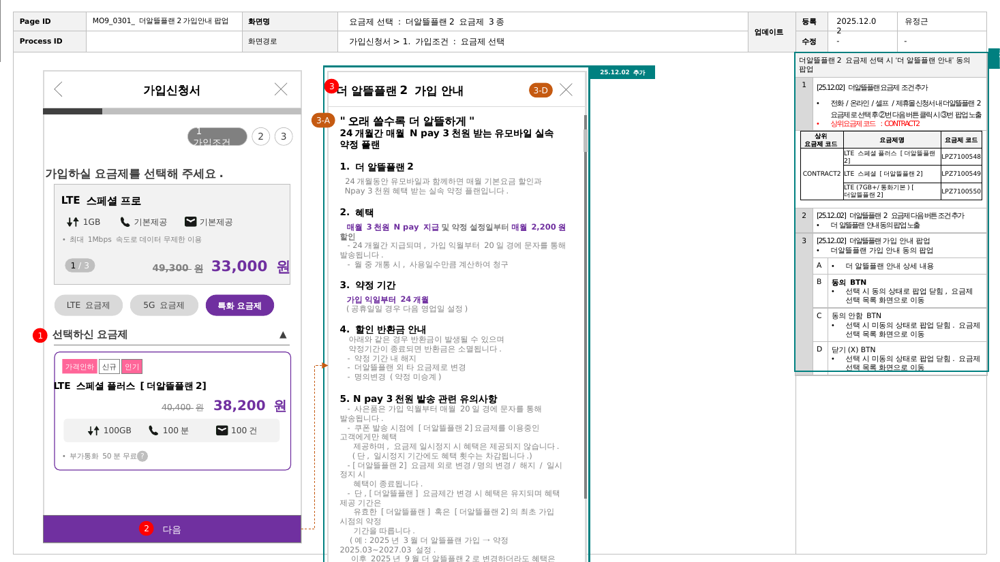

**최종 수정** 2025.12.02 · 유정근
**변경 이력** 25.12.02 가입신청서 더알뜰플랜2 요금제 선택 시 '더 알뜰플랜 안내' 동의 팝업 노출 조건 추가

### 13.1 대상 요금제 — 상위요금제 코드 `CONTRACT2`

| 상위 요금제 코드 | 요금제명 | 요금제 코드 |
|---|---|---|
| `CONTRACT2` | LTE 스페셜 플러스 [더알뜰플랜2] | `LPZ7100548` |
| | LTE 스페셜 [더알뜰플랜2] | `LPZ7100549` |
| | LTE (7GB+/통화기본) [더알뜰플랜2] | `LPZ7100550` |

### 13.2 정의

| 번호 | 정의 |
|---|---|
| **1** | **[25.12.02] 더알뜰플랜 요금제 조건 추가**<br>**전화 / 온라인 / 셀프 / 제휴몰 신청서** 내 더알뜰플랜2 요금제로 선택 후 **②번 다음 버튼 클릭 시 ③번 팝업 노출** |
| **2** | **[25.12.02] 더알뜰플랜2 요금제 다음 버튼 조건 추가** — 더 알뜰플랜 안내 동의 팝업 노출 |
| **3** | **[25.12.02] 더알뜰플랜 가입 안내 팝업** — 더알뜰플랜 가입 안내 **동의 팝업** |
| 3-A | 더 알뜰플랜 안내 **상세 내용** |
| 3-B | **동의 BTN** — 선택 시 **동의 상태**로 팝업 닫힘, 요금제 선택 목록 화면으로 이동 |
| 3-C | **동의 안함 BTN** — 선택 시 **미동의 상태**로 팝업 닫힘, 요금제 선택 목록 화면으로 이동 |
| 3-D | **닫기(X) BTN** — 선택 시 **미동의 상태**로 팝업 닫힘, 요금제 선택 목록 화면으로 이동 |

> **12절(CONTRACT)과의 차이** — 적용 신청서 범위가 **전화/온라인/전화상담 → 전화/온라인/셀프/제휴몰**로 넓습니다.

**금액 출력 예시** — `LTE 스페셜 플러스 [더알뜰플랜2]` `40,400 원` → `38,200 원`

### 13.3 팝업 본문 (전문) — 타이틀 `더 알뜰플랜2 가입 안내`

> **"오래 쓸수록 더 알뜰하게"**
> 24개월간 매월 N pay 3천원 받는 유모바일 실속 약정 플랜
>
> **1. 더 알뜰플랜2**
> 24개월동안 유모바일과 함께하면 매월 기본요금 할인과 Npay 3천원 혜택 받는 실속 약정 플랜입니다.
>
> **2. 혜택**
> 매월 3천원 N pay 지급 및 약정 설정일부터 매월 2,200원 할인
> - 24개월간 지급되며, 가입 익월부터 20일 경에 문자를 통해 발송됩니다.
> - 월 중 개통 시, 사용일수만큼 계산하여 청구
>
> **3. 약정 기간**
> 가입 익일부터 24개월 (공휴일일 경우 다음 영업일 설정)
>
> **4. 할인 반환금 안내**
> 아래와 같은 경우 반환금이 발생될 수 있으며 약정기간이 종료되면 반환금은 소멸됩니다.
> - 약정 기간 내 해지
> - 더알뜰플랜 외 타 요금제로 변경
> - 명의변경 (약정 미승계)
>
> **5. N pay 3천원 발송 관련 유의사항**
> - 사은품은 가입 익월부터 매월 20일 경에 문자를 통해 발송됩니다.
> - 쿠폰 발송 시점에 [더알뜰플랜2] 요금제를 이용중인 고객에게만 혜택 제공하며, 요금제 일시정지 시 혜택은 제공되지 않습니다. (단, 일시정지 기간에도 혜택 횟수는 차감됩니다.)
> - [더알뜰플랜2] 요금제 외로 변경 / 명의 변경 / 해지 / 일시 정지 시 혜택이 종료됩니다.
> - 단, [더알뜰플랜] 요금제간 변경 시 혜택은 유지되며 혜택 제공 기간은 유효한 [더알뜰플랜] 혹은 [더알뜰플랜2]의 최초 가입 시점의 약정 기간을 따릅니다.
> 　(예: 2025년 3월 더 알뜰플랜 가입 → 약정 2025.03~2027.03 설정. 이후 2025년 9월 더 알뜰플랜2로 변경하더라도 혜택은 2027년 3월까지만 제공됩니다.)
>
> **6. 유의사항**
> - 반환금 산정 기준은 '해당 기간까지 받은 요금할인액'을 기준으로 차등 적용되며, 각 이용 기간대별 반환금액을 누적 합산하여 청구됩니다.
> 　[기간별 요금할인액 대비]
> 　0~6개월: 100% / 7~12개월: 50% / 13~16개월: 30% / 17~20개월: -20% / 21~24개월: -40%
> - 약정형 요금제간 요금제 변경이 가능합니다.
> 　(단, 할인금액은 요금제별 사용 일수를 일할 계산하여 제공하며 잔여 약정기간은 계속 유지됩니다)
> - 약정기간 만료 시점에 재약정이 가능하며 약정기간이 만료되면 일반 LTE 요금제로 자동 전환됩니다.

**버튼** — `동의 안함` / `동의` (+ 우상단 `X`)

---

## 14. slide 89 — [bottomsheet] 사은품선택 (`MO9_0301_L01`) <sup>신규개발</sup>

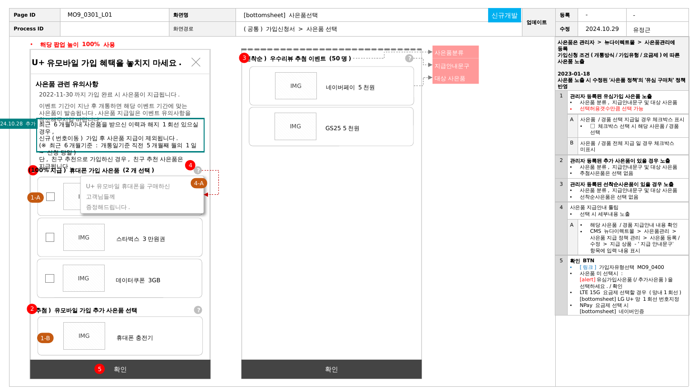

**최종 수정** 2024.10.29 · 유정근 · **경로** `(공통) 가입신청서 > 사은품 선택`
**레이아웃 지시** — **해당 팝업 높이 100% 사용**

### 14.1 변경 이력

| 일자 | 내용 |
|---|---|
| 23.01.18 | 사은품정책 / 유심 구매처별 사은품 안내 개선 |
| 23.06.29 | 가입신청서 작성 - 요금제 선택 정보 제공 영역 추가 요청 |
| 24.03.19 | 사은품 발송 안내 문구 수정 |
| 24.10.14 | 가입신청서 내 유의사항 내용 수정 요청 |
| 24.10.28 | 가입신청서 내 유의사항 내용 추가 요청 |

### 14.2 노출 조건 (헤더)

```
사은품은 관리자 > 뉴다이렉트몰 > 사은품관리에 등록
가입신청 조건(개통방식 / 가입유형 / 요금제)에 따른 사은품 노출
2023-01-18 사은품 노출 시 수정된 '사은품 정책'의 '유심 구매처' 정책 반영
```

> **이 세 값(개통방식 · 가입유형 · 요금제)이 모두 확정되어야 목록을 확정할 수 있습니다.** 현 설계서 `C-48`의 근거입니다.

### 14.3 영역 정의

| 번호 | 영역 | 정의 |
|---|---|---|
| **1** | 유심가입 사은품 | 관리자 등록된 **유심가입 사은품 노출**<br>사은품 분류, 지급안내문구 및 대상 사은품<br>**선택허용갯수만큼 선택 가능** |
| 1-A | 선택형 | 사은품/경품 **선택 지급**일 경우 **체크박스 표시**<br>`□` 체크박스 선택 시 해당 사은품/경품 선택 |
| 1-B | 전체 지급형 | 사은품/경품 **전체 지급**일 경우 **체크박스 미표시** |
| **2** | 추가 사은품 | 관리자 등록된 **추가 사은품이 있을 경우 노출**<br>사은품 분류, 지급안내문구 및 대상 사은품<br>**추첨사은품은 선택 없음** |
| **3** | 선착순 사은품 | 관리자 등록된 **선착순사은품이 있을 경우 노출**<br>사은품 분류, 지급안내문구 및 대상 사은품<br>**선착순사은품은 선택 없음** |
| **4** | 사은품 지급안내 툴팁 | `?` 선택 시 세부내용 노출 |
| 4-A | 툴팁 내용 | `CMS 뉴다이렉트몰 > 사은품관리 > 사은품 지급 정책 관리 > 사은품 등록/수정 > 지급 상품`의 **'지급 안내문구'** 항목에 입력한 내용 표시 |
| **5** | 확인 BTN | `[링크] 가입자유형선택 MO9_0400`<br>**사은품 미선택 시** : `[alert] 유심가입사은품(/추가사은품)을 선택하세요.` `확인`<br>**LTE 15G 요금제 선택할 경우 (망내1회선)** : `[bottomsheet] LG U+망 1회선 번호지정`<br>**NPay 요금제 선택 시** : `[bottomsheet] 네이버인증` |

> 사은품 분류는 **3종**입니다 — ① 선택형/전체지급형(유심가입) ② 추첨(추가) ③ 선착순.
> **선택 액션이 있는 것은 ①뿐**이고, ②·③은 안내만 합니다. 그래서 미선택 alert도 ①·②를 대상으로 문구가 쓰여 있습니다.

### 14.4 화면 텍스트 (전문)

**타이틀** — `U+유모바일 가입 혜택을 놓치지 마세요.`

**사은품 관련 유의사항**

> 2022-11-30까지 가입 완료 시 사은품이 지급됩니다.
> 이벤트 기간이 지난 후 개통하면 해당 이벤트 기간에 맞는 사은품이 발송됩니다. 사은품 지급일은 이벤트 유의사항을 참조해주시길 바랍니다.

**24.10.28 추가 문구**

> 최근 6개월이내 사은품을 받으신 이력과 해지 1회선 있으실 경우, 신규(번호이동) 가입 후 사은품 지급이 제외됩니다.
> (※ 최근 6개월기준 : 개통일기준 직전 5개월째 월의 1일 ~ 신청 당일)
> 단, 친구 추천으로 가입하신 경우, 친구 추천 사은품은 지급됩니다.

> 유의사항의 `2022-11-30`은 원본 목업에 남아 있는 **과거 날짜**입니다(원본 미갱신).

### 14.5 사은품 그룹 목업 값

| 그룹 헤더 | 툴팁 내용 | 대상 사은품 |
|---|---|---|
| `(100%지급) 휴대폰 가입 사은품 (2개 선택)` | U+유모바일 휴대폰을 구매하신 고객님들께 증정해드립니다. | 데이터쿠폰 3GB |
| `(추첨) 유모바일 가입 추가 사은품 선택` | — | 휴대폰 충전기 / 스타벅스 3만원권 / 신세계 상품권 3만원 |
| `(선착순) 우수리뷰 추첨 이벤트 (50명)` | — | 네이버페이 5천원 / GS25 5천원 |

**CTA** — `확인`

---

## 15. slide 90 — [bottomsheet] 사은품선택 : S Plus 요금제

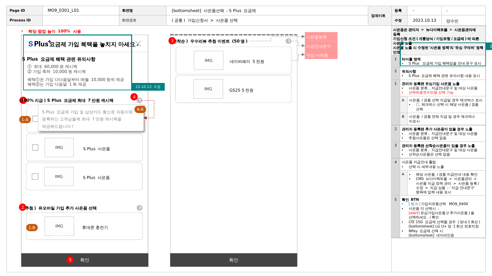

**최종 수정** 2023.10.13 · 양수빈 · **변경 이력** 23.10.13 S Plus 요금제로 가입 시 사은품 선택 팝업 문구 수정

**89p와 구조는 동일**하며, **타이틀과 유의사항 영역만 S Plus 전용 문구로 치환**됩니다.

| 번호 | 정의 |
|---|---|
| **1** (상단) | **타이틀 영역** — S Plus 요금제 가입 혜택임을 안내하는 문구 표시 |
| **2** (상단) | **유의사항** — S Plus 요금제 혜택 관련 유의사항 내용 표시 |

*(이하 1 · 1-A · 1-B · 2 · 3 · 4 · 4-A · 5 정의는 89p와 동일)*

> 원본에서 상단 타이틀/유의사항 정의에 **1 · 2 번호가 중복 부여**되어 있습니다(사은품 영역에도 1 · 2 · 3이 있음). 원본 표기 그대로입니다.

### 화면 텍스트 (전문)

**타이틀** — `요금제 가입 혜택을 놓치지 마세요.` <sup>23.10.13 수정</sup>

**S Plus 요금제 혜택 관련 유의사항** <sup>23.10.13 수정</sup>

> ① 최대 60,000원 캐시백 ② 가입 축하 10,000원 캐시백
> 혜택①은 가입 다다음달부터 매월 10,000원씩 제공, 혜택②는 가입 다음달 1회 제공

**사은품 그룹** — `(100%지급) S Plus 요금제 최대 7만원 캐시백`

> S Plus 요금제 가입 및 삼성카드 통신료 자동이체 등록하신 고객님들께 최대 7만원 캐시백을 제공해드립니다!

---

## 16. slide 91 — [bottomsheet] 쿠팡 회원정보 입력 (`MO9_0301_L04`)

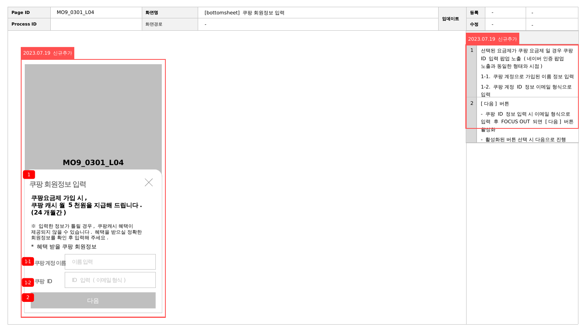

**신규 추가** 2023.07.19 · **변경 이력** 23.07.19 유플러스 쿠팡제휴요금제 출시 관련 기능 개발

| 번호 | 정의 |
|---|---|
| **1** | 선택된 요금제가 **쿠팡 요금제일 경우 쿠팡ID 입력 팝업 노출**<br>**(네이버 인증 팝업 노출과 동일한 형태와 시점)** |
| 1-1 | **쿠팡 계정으로 가입된 이름** 정보 입력 |
| 1-2 | **쿠팡 계정 ID** 정보 **이메일 형식**으로 입력 |
| **2** | **[다음] 버튼**<br>· 쿠팡 ID 정보 입력 시 이메일 형식으로 입력 후 **FOCUS OUT 되면 [다음] 버튼 활성화**<br>· 활성화된 버튼 선택 시 다음으로 진행 |

### 화면 텍스트 (전문)

**타이틀** — `쿠팡 회원정보 입력`

> 쿠팡요금제 가입 시, 쿠팡 캐시 월 5천원을 지급해 드립니다. (24개월간)
> ※ 입력한 정보가 틀릴 경우, 쿠팡캐시 혜택이 제공되지 않을 수 있습니다. 혜택을 받으실 정확한 회원정보를 확인 후 입력해 주세요.

**입력 필드**

| 라벨 | placeholder |
|---|---|
| `* 혜택 받을 쿠팡 회원정보` (섹션 제목) | — |
| 쿠팡 계정 이름 | `이름 입력` |
| 쿠팡 ID | `ID 입력 (이메일 형식)` |

**CTA** — `다음` (초기 비활성 → 이메일 형식 입력 + FOCUS OUT 시 활성)

---

## 17. slide 92 — [bottomsheet] 1회선번호지정 (`MO9_0301_L02`)

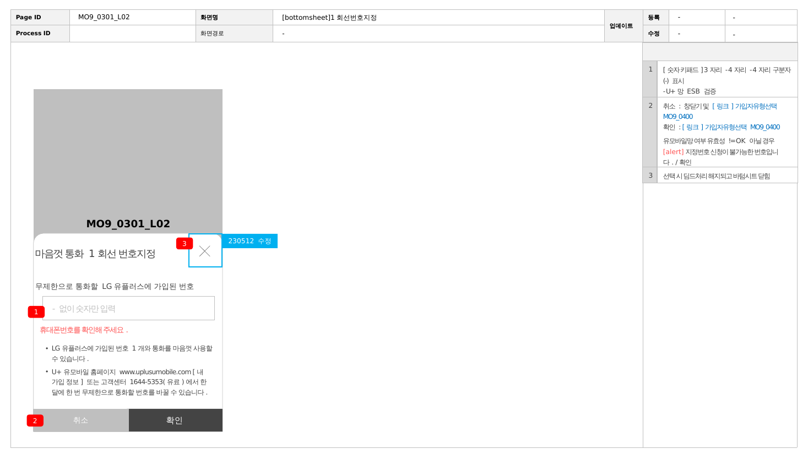

**변경 이력** 23.05.12 X 버튼 기능정의

| 번호 | 정의 |
|---|---|
| **1** | **[숫자 키패드]** `3자리 - 4자리 - 4자리` **구분자(-) 표시**<br>**U+망 ESB 검증** |
| **2** | **취소** : 창닫기 및 `[링크] 가입자유형선택 MO9_0400`<br>**확인** : `[링크] 가입자유형선택 MO9_0400`<br>**유모바일망 여부 유효성 != OK 인 경우** : `[alert] 지정번호 신청이 불가능한 번호입니다.` `확인` |
| **3** | **X 버튼** — 선택 시 **딤드처리 해지되고 바텀시트 닫힘** <sup>230512 수정</sup> |

> **취소와 확인이 모두 `MO9_0400`으로 이동**합니다 — 번호 지정을 건너뛰어도 다음 단계로 진행됩니다.
> 반면 **X 버튼은 바텀시트만 닫습니다**(이동 없음). 세 버튼의 귀결이 서로 다릅니다.

### 화면 텍스트 (전문)

**타이틀** — `마음껏 통화 1회선 번호지정`

| 항목 | 내용 |
|---|---|
| 입력 라벨 | 무제한으로 통화할 LG유플러스에 가입된 번호 |
| placeholder | `- 없이 숫자만 입력` |
| 에러 문구 | 휴대폰번호를 확인해 주세요. |

**안내 문구**

> LG유플러스에 가입된 번호 1개와 통화를 마음껏 사용할 수 있습니다.
> U+유모바일 홈페이지 www.uplusumobile.com [내 가입 정보] 또는 고객센터 1644-5353(유료)에서 한 달에 한 번 무제한으로 통화할 번호를 바꿀 수 있습니다.

**버튼** — `취소` / `확인`

---

## 18. slide 93 — [bottomsheet] 네이버인증 (`MO9_0301_L03`)

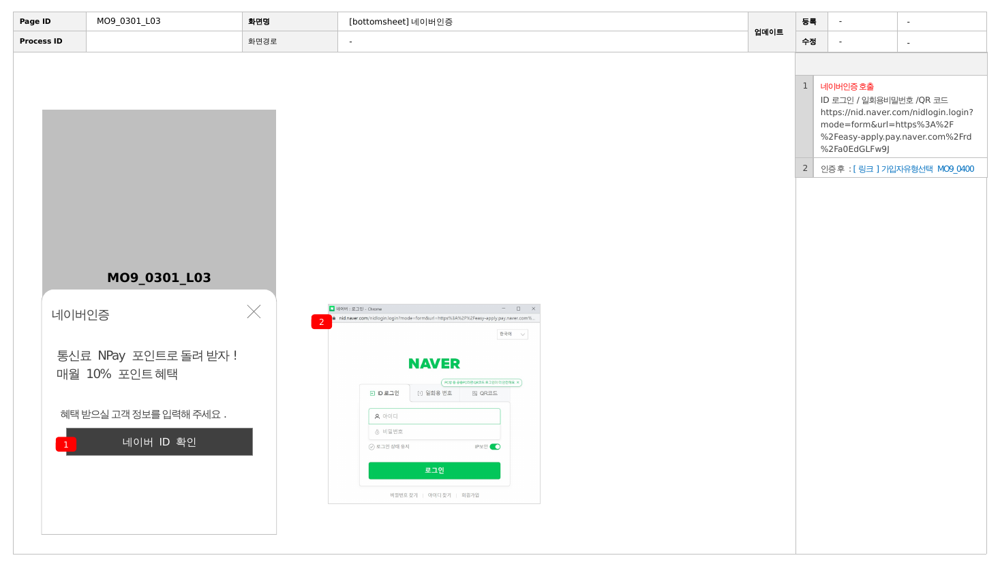

| 번호 | 정의 |
|---|---|
| **1** | **네이버인증 호출**<br>ID로그인 / 일회용비밀번호 / QR코드<br>`https://nid.naver.com/nidlogin.login?mode=form&url=https%3A%2F%2Feasy-apply.pay.naver.com%2Frd%2Fa0EdGLFw9J` |
| **2** | **인증 후** : `[링크] 가입자유형선택 MO9_0400` |

### 화면 텍스트 (전문)

**타이틀** — `네이버인증`

> 통신료 NPay 포인트로 돌려 받자!
> 매월 10% 포인트 혜택
>
> 혜택 받으실 고객 정보를 입력해 주세요.

**입력 필드** — `네이버 ID ●` / `비밀번호 ●`
**CTA** — `네이버 ID 확인`

> 이 화면은 **네이버 로그인 페이지를 호출**하는 형태입니다. 자체 입력 폼이 아니라 외부 인증 연동입니다.

---

## 19. 부록 A — 요금제 선택 구간 팝업·Alert 전수

| # | 트리거 시점 | 조건 | 유형 | 버튼 | 출처 |
|---|---|---|---|---|---|
| 1 | **화면 진입 직후** | 원칩 + 셀프개통 + 010 신규가입 (온세일) | 안내 팝업 | 확인 | 76p |
| 2 | 요금제 **선택 시** | 시니어 요금제 | alert | 확인 | 78p |
| 3 | 요금제 **선택 시** | 이십세 요금제 | alert | 확인 | 78p |
| 4 | 요금제 **선택 시** | 청소년 요금제 | alert | 확인 | 78p |
| 5 | 요금제 **선택 시** | 셀프개통 && 청소년 요금제 | alert | 취소 / 확인 | 78p |
| 6 | 요금제 **선택 시** | 셀프개통 && 데이터 0GB 차단 (`U_DATA0GB`/`H_DATA0GB`) | alert | 확인 / 취소 | 85p |
| 7 | 요금제 **선택 시** | 온라인·전화상담 && 데이터 0GB 차단 | alert | 확인 | 86p |
| 8 | **다음 버튼 클릭 시** | 유독할인 요금제 (셀프/온라인 개통 고객) | alert | 다시 선택 / 확인 | 84p |
| 9 | **다음 버튼 클릭 시** | 실손약정 `CONTRACT` 3종 | 동의 팝업 | 동의 안함 / 동의 / X | 87p |
| 10 | **다음 버튼 클릭 시** | 더알뜰플랜2 `CONTRACT2` 3종 | 동의 팝업 | 동의 안함 / 동의 / X | 88p |
| 11 | **제휴카드 확인 클릭 시** | 제휴카드 선택 완료 상태 | alert | 취소 / 확인 | 82p |
| 12 | **확정(다음) 이후** | 동일 IP 4회선 초과 (`MO9_0600_L05`) | 팝업 | 확인 → 창닫기 | 79p |
| 13 | **사은품 시트 확인 클릭 시** | 선택형 사은품 미선택 | alert | 확인 | 89p |
| 14 | **1회선 번호지정 확인 클릭 시** | 유모바일망 여부 유효성 != OK | alert | 확인 | 92p |

**Alert 문구 (89p · 92p)**

> `[alert] 유심가입사은품(/추가사은품)을 선택하세요.` — 확인
> `[alert] 지정번호 신청이 불가능한 번호입니다.` — 확인

> 78p Alert 4종은 **선택 시점**, 84·87·88p는 **다음 버튼 시점**, 89·92p는 **확정 이후 시트 안**입니다. 이 3단 구분이 화면 설계상 중요합니다.

---

## 20. 부록 B — 확정(다음) 이후 분기 전수

| 조건 | 분기 |
|---|---|
| 기본 | `[bottomsheet] 사은품선택` (본문 `MO9_0302` / 사은품 슬라이드 `MO9_0301_L01`) |
| **LTE 15G 요금제 (망내1회선)** | `[bottomsheet] LG U+망 1회선 번호지정` (`MO9_0301_L02`) |
| **NPay 요금제** | `[bottomsheet] 네이버인증` |
| **쿠팡 요금제** | `[bottomsheet] 쿠팡 회원정보 입력` (`MO9_0301_L04`) |
| **POS 코드 4종** (`P403513` · `P685974` · `P824432` · `P532875`) | 사은품 선택 bottomsheet **미노출** |
| **동일 IP 4회선 초과** | 안내 팝업 → 확인 시 **가입신청서 창닫기** |
| 이전 | `[링크] 가입유형선택 MO9_0800` |

### 시트별 종료 지점

| 시트 | 화면 코드 | 확인 시 이동 | 취소/닫기 시 |
|---|---|---|---|
| 사은품선택 | `MO9_0301_L01` | `MO9_0400` 가입자유형선택 | (미선택 시 alert로 차단) |
| 1회선 번호지정 | `MO9_0301_L02` | `MO9_0400` | **취소도 `MO9_0400`** / **X는 시트만 닫힘** |
| 네이버인증 | `MO9_0301_L03` | 인증 후 `MO9_0400` | — |
| 쿠팡 회원정보 입력 | `MO9_0301_L04` | 다음 (활성 조건 = 이메일 형식 + FOCUS OUT) | — |

> 네 시트 모두 최종 귀결은 **`MO9_0400` 가입자유형선택**입니다.
> 원본 순서는 `요금제(MO9_0301) → 사은품(L01) → 종속 입력 시트 → 가입자유형(MO9_0400)`입니다.

---

## 21. 부록 C — CMS 관리 항목 매핑 (요금제 구간 전체)

| 화면 요소 | CMS 경로 |
|---|---|
| 요금제 필터명·순서 | 공통 > 상품관리 > 요금제관리 > **요금제 필터관리** |
| 요금제 그룹 | 공통 > 상품관리 > 요금제관리 > 요금제 정보관리 > **[Tab] 요금제 그룹** |
| 상위 요금제 (컨텐츠·카테고리·네트워크 LTE/5G) | … > **[Tab] 상위요금제** |
| 요금제명·데이터·음성·메시지·QoS설정·요금제 뱃지·가격 프로모션 안내 | … > **[Tab] 하위요금제** |
| 프로모션가(무약정) · 기본료(무약정) | 공통 > 요금제관리 > 요금제 기타관리 > **[Tab] 프로모션요금(다이렉트몰)** |
| 추천 요금제 (3개·우선순위) | 공통 > 상품관리 > 요금제관리 > 요금제 기타관리 > **추천 요금제(다이렉트몰)** |
| 약정할인 금액(부가세포함) | 공통 > 요금제관리 > 요금제 정보관리 > 하위요금제 > **약정할인** |
| 카드 이미지(가입페이지용) · 카드명 · 카드 요약 정보 > 전월카드 이용실적\* · 할인금액(최소~최대) · 할인 계산 기준 금액\* · 가입신청서 유의사항 · 순서변경 | **제휴카드 관리** |
| 사은품 목록 · 노출 조건(개통방식/가입유형/요금제) | 관리자 > 뉴다이렉트몰 > **사은품관리** |
| 사은품 지급 안내문구 (툴팁) | CMS 뉴다이렉트몰 > 사은품관리 > **사은품 지급 정책 관리 > 사은품 등록/수정 > 지급 상품 > '지급 안내문구'** |

> 요금제 구간에서 **신규 백오피스 관리 항목은 없습니다.** 전부 기존 CMS 항목을 읽어 씁니다.

---

## 22. 부록 D — 요금제 코드 · 모델 코드 전수

| 구분 | 코드 | 내용 |
|---|---|---|
| 상위요금제 | `CONTRACT` | 실손약정(더 알뜰플랜) 3종 |
| 상위요금제 | `CONTRACT2` | 더알뜰플랜2 3종 |
| 소분류 | `U_DATA0GB` | 유심 데이터차단 (0GB/통화기본) |
| 소분류 | `H_DATA0GB` | [휴대폰] 데이터차단 (0GB/통화기본) |
| 요금제 | `LPZ7100428` / `LPZ7100429` / `LPZ7100430` | 약정형 3종 |
| 요금제 | `LPZ7100548` / `LPZ7100549` / `LPZ7100550` | 더알뜰플랜2 3종 |
| 요금제 | `LPZ0019033` | LTE (2GB/120분) — 단말 결합 요금할인 (미사용) |
| 원칩 유심모델 | `K3620` · `K3630` · `U8680` | 진입 안내 팝업 판정 |
| 쿠팡 원칩모델 | `K3620` · `3630` | 쿠팡요금제 노출 (미사용) |
| 단말 모델 | `RF-SM-S901N` | (중고)갤럭시 S22 256G — LTE·5G 모두 노출 |
| 단말 모델 | `SM-A235N` · `SM-G525N-UC` · `RF-A2221-64` · `RF-A2221-128` | 단말 결합 요금할인 대상 (미사용) |
| POS | `P403513` · `P685974` · `P824432` · `P532875` | 사은품 bottomsheet 미노출 |
| 화면 | `MO9_0301` | 요금제 목록 |
| 화면 | `MO9_0301_P01` | [팝업] 제휴카드 할인 계산해보기 |
| 화면 | `MO9_0301_틴즈클럽` | 갤럭시 틴즈 요금제 목록 |
| 화면 | `MO9_0301_L01` | [bottomsheet] 사은품선택 |
| 화면 | `MO9_0301_L02` | [bottomsheet] 1회선번호지정 |
| 화면 | `MO9_0301_L03` | [bottomsheet] 네이버인증 |
| 화면 | `MO9_0301_L04` | [bottomsheet] 쿠팡 회원정보 입력 |
| 화면 | `MO9_0302` | 사은품선택 (79p 본문 표기 — L01과 불일치) |
| 화면 | `MO9_0400` | 가입자유형선택 (요금제 구간의 종료 지점) |
| 화면 | `MO9_0600_L05` | 동일 IP 다회선 제한 안내 |
| 화면 | `MO9_0800` | 가입유형선택 (요금제 구간의 이전 화면) |
| 외부 | `nid.naver.com/nidlogin.login?…easy-apply.pay.naver.com/rd/a0EdGLFw9J` | 네이버인증 호출 URL |
| 고객센터 | `1644-5353` (유료) · `www.uplusumobile.com` | 1회선 번호지정 안내 문구 |

---

## 23. 부록 E — 현 S-02 설계서와의 대응

| 원본 (slide) | 현 설계서 |
|---|---|
| 75p 상품 유형별 목록 분기 | `C-56` |
| 75p 전용 요금제 진입 | `C-57` 단독 노출 모드 |
| 76p 진입 안내 팝업 | `C-55` |
| 77p 추천 요금제 3개 캐러셀 | **제거** — `C-13` · `C-21` |
| 77p 요금제 필터 (LTE/5G/특화) | `C-14` 탭 재구성 (주간 BEST · 전체 · LTE · 5G) |
| 77p 요금제 그룹 아코디언 | **제거** — 단일 목록으로 재편 |
| 77p 선택하신 요금제 | `C-25` 케이스 A · `C-31` |
| 77p `26.04.06` 선택된 요금제 있으면 단계 미노출 | `C-25` |
| 78p 1-A~1-F 카드 정보 | `C-30` 가격 · `C-34` 유형 정보 내재화 |
| 78p 1-G · 1-H QoS | `C-58` 속도 안내 레이어 |
| 78p 1-I 뱃지 | `C-15` · `C-37` (최대 2개) |
| 78p 1-J 가격 프로모션 안내 | `C-59` 높이 유지 |
| 78p Alert 4종 (자격 제한) | `C-49` 제약 라인으로 전환 (Alert 제거) · `C-28` |
| 78p 셀프개통 && 청소년 | `EX-03` 경로 전환 확인 · `C-50` |
| 79p 1 월 납부 금액 | `C-51` Sticky 금액 명세 |
| 79p 1-B 제휴카드 할인포함 명칭 전환 | **미채택** — 합산 표기하지 않음 (`C-52`) |
| 79p 2 제휴카드 할인금액(예상) | `C-52` → **`C-60` 제휴카드 선택 화면으로 재설계** |
| 79p 3 다음 분기 (사은품·망내1회선·NPay·쿠팡) | `C-48` 사은품 위치 이동 · `C-53` 요금제 종속 입력 |
| 79p 3-A 동일 IP 4회선 | `C-54` · `EX-04` |
| 82p 제휴카드 팝업 (셀렉트 + 확인 alert) | **`C-60`** — 목록 전개 · 확인 Alert 제거 |
| 89p 사은품선택 시트 (개통방식·가입유형·요금제 의존) | `C-48` — **가입 방법 확정 직후로 이동** · 선택 대상 0건이면 미노출 |
| 89p 사은품 미선택 alert | `C-48` 원본 유지 |
| 90p S Plus 사은품 문구 치환 | `C-57` 단독 노출 모드와 동일 진입 계열 |
| 91p 쿠팡 회원정보 · 92p 1회선 번호지정 · 93p 네이버인증 | `C-53` **확정 후 요금제 종속 입력** — 요금제 화면에 남김 |
| 92p X 버튼 딤 해제 · 시트 닫힘 | `C-47` 시트 닫기 동작 준용 |
| 89~93p 종료 지점 `MO9_0400` | TO-BE `S-05 가입자 유형 선택` |
| 83p S Plus | `C-57` 단독 노출 모드 |
| 84p 유독할인 | `C-50` 확정 시점 팝업 |
| 85p · 86p 데이터 0GB 차단 | `C-49` · `EX-03` |
| 87p · 88p 약정 동의 | `C-50` 약정 동의 · `C-12` 세션 승계 |

---

## 24. 원본에서 발견된 표기 문제 (미교정 · 기록용)

| 위치 | 내용 |
|---|---|
| 78p 1-G | `OoS 정보` — `QoS` 오타 |
| 79p 3 | 사은품 bottomsheet 코드 `MO9_0302` ↔ 89p `MO9_0301_L01` **불일치** |
| 79p 목업 | 휴대폰 합계 42,090원 ≠ 39,190 + 19,900 — 케이스가 다른 값의 혼재 |
| 83p 목업 | 요금제명 `95GB+` / `10GB+` ↔ 데이터 표기 `71GB` / `15GB` 불일치 |
| 85p | 상위요금제 코드 번호가 **1 · 3**으로 2번 결번 |
| 85p · 86p | 본문 `24.12.26` ↔ 이력·헤더 `24.12.27` 하루 차이 |
| 87p · 88p | 반환금 비율 `17~20개월: -20%` · `21~24개월: -40%` 음수 부호 |
| 75p | 쿠팡 원칩모델코드 `K3620, / 3630` — 두 번째 `K` 누락 추정 |
| 89p | 유의사항 목업 날짜가 `2022-11-30`으로 **과거 날짜 그대로** 남아 있음 |
| 90p | 상단 타이틀·유의사항 정의에 `1` · `2` 번호가 사은품 영역과 **중복 부여** |

> 이 항목들은 **원본 수정 대상 후보**입니다. 문서(설계서) 측 교정 정책은 `index.html` 문서 사용 안내 참조 — 피그마 컴포넌트·프레임 명칭은 원문 유지, 일반 서술문만 교정.
